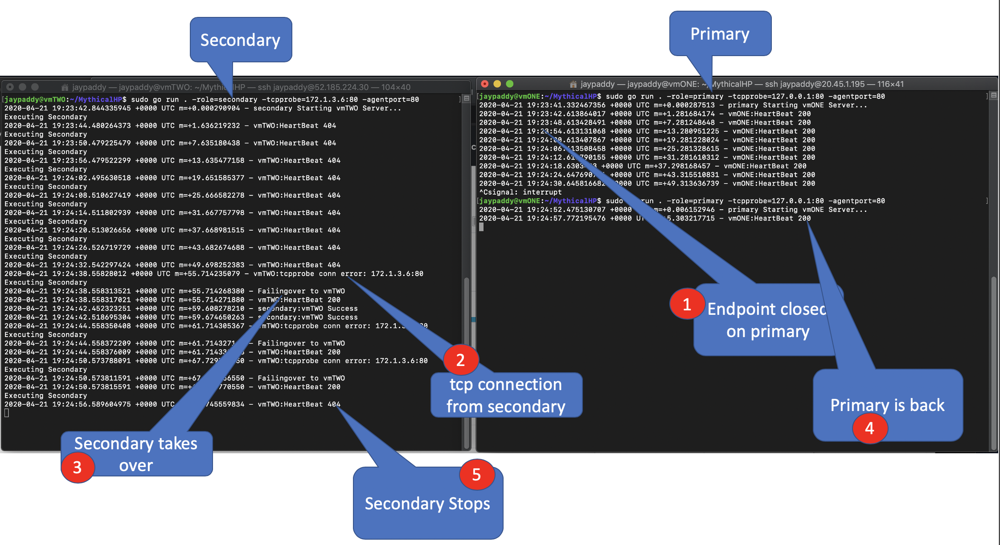

# MythicalHP
MythicalHP
This is a simple introduction to enabling Primary & Secondary with Azure Standard Load Balancer. A SLB with 2 VMs, will need to support Active Passive mode. When the Primary server goes down, the Secondary will need to be Active. When Primary comes back up, Secondary will need to go passive

High Level Architecture Diagram

Call Sequence between Primary and Secondary

## Steps
* Ubuntu VMs
* Deploy Standard Load Balancer with Backend Pool
* Install https://github.com/golang/go/wiki/Ubuntu
* go get -u github.com/gorilla/mux
* git clone https://github.com/jaypaddy/MythicalHP.git
* cd MythicalHP
* [PRIMARY] sudo go run . -role=primary -tcpprobe=primarymq -agentport=80
* [SECONDARY] sudo go run . -role=secondary -tcpprobe=primarymq -agentport=80

role = this is the role of the server where the agent is running. Assumption is that the agent will run on the same server as the primary service i.e. the workload

tcpprobe = this will be tcp service that needs to be assessed for health

agentport = the port at which the agent will run. this should match with the port used on the Load Balancer Healthprobe. On the loadbalancer it will be specified as http://<server>:<agentport>/healthprobe

Example Output

## Ubuntu Service Setup
### [Adapted from https://fabianlee.org/2017/05/21/golang-running-a-go-binary-as-a-systemd-service-on-ubuntu-16-04/]
sudo useradd mythicalagent -s /sbin/nologin -M
sudo cp mythicalagent.service /lib/systemd/system/.
sudo chmod 755 /lib/systemd/system/mythicalagent.service
sudo systemctl enable mythicalagent.service
sudo systemctl start mythicalagent
sudo journalctl -f -u mythicalagent

PS> Get-LogicAppTemplate -Token (az account get-access-token | ConvertFrom-Json).accessToken -LogicApp CheckTravelTime -ResourceGroup CNE_DEV_RG -SubscriptionId 881ac365-d417-4791-b2a9-48789acbb88d -Verbose | Out-File template.json