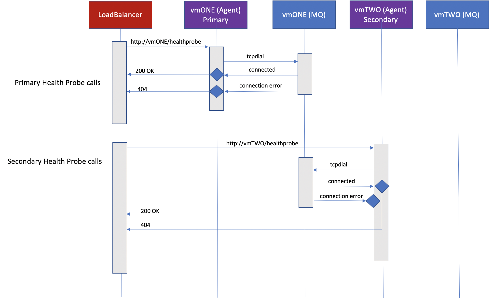

# MythicalHP
MythicalHP
This is a simple introduction to enabling Primary & Secondary with Azure Standard Load Balancer. A SLB with 2 VMs, will need to support Active Passive mode. When the Primary server goes down, the Secondary will need to be Active. When Primary comes back up, Secondary will need to go passive

## Steps
* Ubuntu VMs
* Deploy Standard Load Balancer with Backend Pool
* Install https://github.com/golang/go/wiki/Ubuntu
* go get -u github.com/gorilla/mux
* git clone https://github.com/jaypaddy/MythicalHP.git
* cd MythicalHP
* [PRIMARY] sudo go run . 200 http://localhost/healthprobe
* [SECONDARY] sudo go run . 400 http://<PRIMARYIP>/healthprobe

